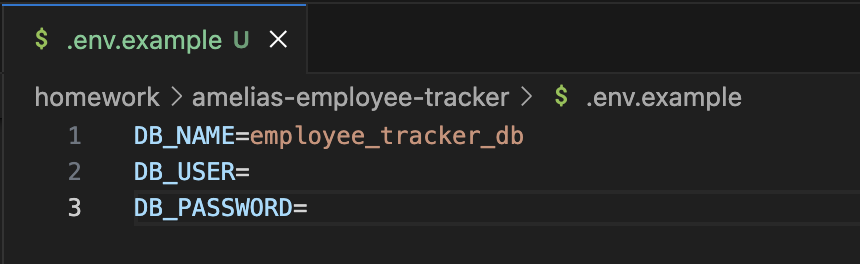
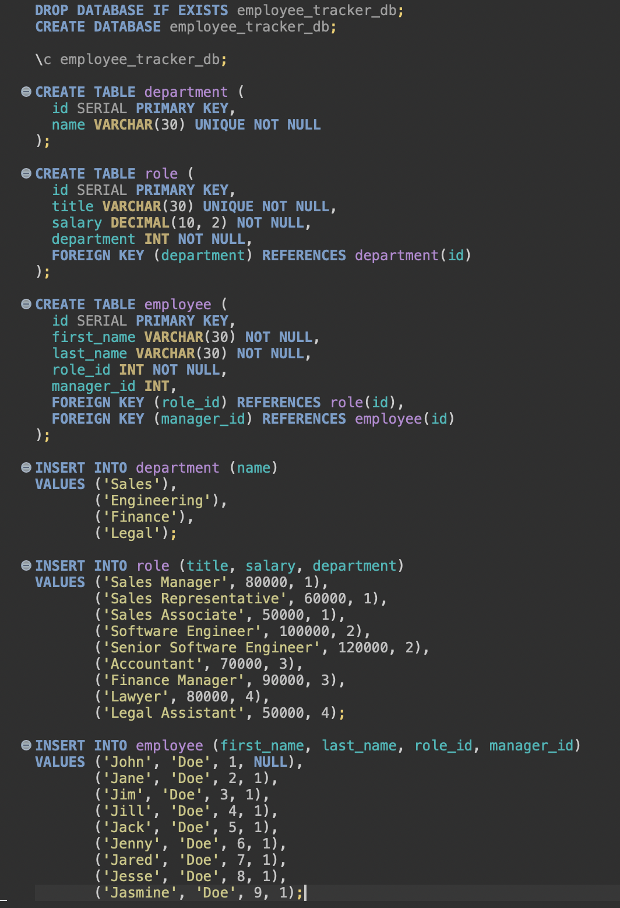
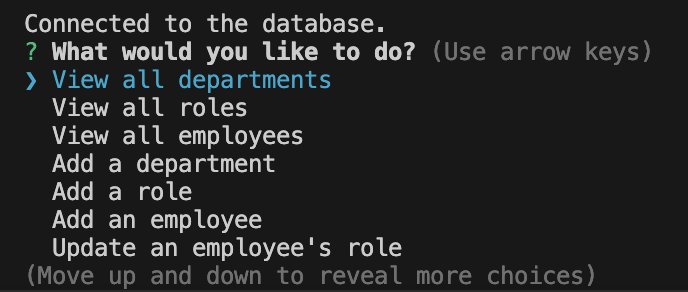
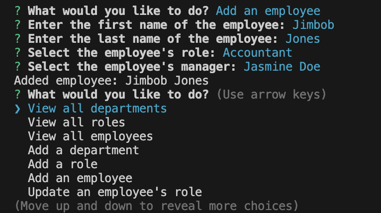
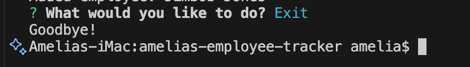

# Amelia's Employee Tracker


## Description

This project was completed as part of the Module 10 Challenge for the Rutgers University Coding Bootcamp. In this project, a content management system (CMS) was created to allow a company to track employees, roles, and departments. The program is run in the command line and gives the user several options to choose from, including viewing all the departments, roles, and employees, and adding departments, roles, and employees. This application is useful in the real world because it allows employers to update their employee databases easily and quickly. During the development of this project, I learned how to design a command-line application from scratch, how to connect a database to a TypeScript file, and how to edit databases using TypeScript commands. The experience gained from this project could be especially useful in data analysis projects later on.

## Table of Contents (Optional)

- [Installation](#installation)
- [Usage](#usage)
- [Walkthrough Video](#walkthrough-video)
- [Credits](#credits)
- [License](#license)
- [Questions](#questions)

## Installation

1. In the terminal, navigate to where you would like the repo to be stored on your device.

2. Using the HTTPS or SSH key found in the GitHub repo, clone the repo to your device using the following:

    ```sh
    git clone <filepath>
    ```

3. Switch into the amelias-employee-tracker directory:

    ```sh
    cd amelias-employee-tracker
    ```

4. An .env.example file has been created to allow users to connect to a database. Remove the '.example' from the end of this file name, and enter your database username and password here.

    

5. If you do not already have employee, role, and department data stored in your database, you will need to run the schema.sql and seeds.sql files in the db folder in your preferred PostgreSQL application. Here, I'm using DBeaver:

    

6. In the command line, install dependencies using the following (be sure that you are in the correct directory):

    ```sh
    npm i
    ```

## Usage

1. After the installation steps have been completed, build and start the program using the following:

    ```sh
    npm start
    ```

2. You should see that you have been connected to a database and then provided a list of options to choose from. If you did not connect to the database, revisit step 4 under Installation. Use the arrow keys to scroll through these options.

    

3. Some choices require no input from the user. For example, 'View all departments' will output all departments in the database and then return to the main menu. Some choices require input, like 'Add a role' or 'Add an employee'. Follow the prompts and use the arrows to scroll through the options, or type and hit enter where written input is needed. Here, I'm showing the prompts for the 'Add an employee' option:

    

4. You will be returned to the main menu after you have completed all the necessary input. When you are ready to exit the application, scroll to the 'Exit' option. You should see 'Goodbye!' in the console.

    

## Walkthrough Video

link to video here

## Credits

Although no starter code was available for this project and the project has been designed from scratch, I used some files from previous projects to get started. The package.json file was originally from the Module 8 Challenge (Rutgers University Coding Bootcamp > RUT-VIRT-FSF-PT-10-2024-U-LOLC-MWTH > Assignments > Module 8 Challenge, https://bootcampspot.instructure.com/courses/6369/assignments/90394?module_item_id=1341044). I made a few additions to this file to be able to implement PostgreSQL databases. The tsconfig.json and connection.ts files are from the Module 10 Mini Project (Rutgers University Coding Bootcamp > RUT-VIRT-FSF-PT-10-2024-U-LOLC-MWTH > Pages > 10. Day 3, https://bootcampspot.instructure.com/courses/6369/pages/10-day-3?module_item_id=1341155). The .gitignore file was created by GitHub, as I created the repo online and added the .gitignore file there. The db folder and files, assets folder and files, .env.example file, and index.ts file were developed by myself with the assistance of GitHub Copilot and ChatGPT.

GitHub: amelia1105 (https://github.com/amelia1105)

## License

MIT License

Copyright (c) 2025 Amelia Bellanger

Permission is hereby granted, free of charge, to any person obtaining a copy
of this software and associated documentation files (the "Software"), to deal
in the Software without restriction, including without limitation the rights
to use, copy, modify, merge, publish, distribute, sublicense, and/or sell
copies of the Software, and to permit persons to whom the Software is
furnished to do so, subject to the following conditions:

The above copyright notice and this permission notice shall be included in all
copies or substantial portions of the Software.

THE SOFTWARE IS PROVIDED "AS IS", WITHOUT WARRANTY OF ANY KIND, EXPRESS OR
IMPLIED, INCLUDING BUT NOT LIMITED TO THE WARRANTIES OF MERCHANTABILITY,
FITNESS FOR A PARTICULAR PURPOSE AND NONINFRINGEMENT. IN NO EVENT SHALL THE
AUTHORS OR COPYRIGHT HOLDERS BE LIABLE FOR ANY CLAIM, DAMAGES OR OTHER
LIABILITY, WHETHER IN AN ACTION OF CONTRACT, TORT OR OTHERWISE, ARISING FROM,
OUT OF OR IN CONNECTION WITH THE SOFTWARE OR THE USE OR OTHER DEALINGS IN THE
SOFTWARE.

## Questions

For any questions about this project, please contact me by email: aebellanger@yahoo.com